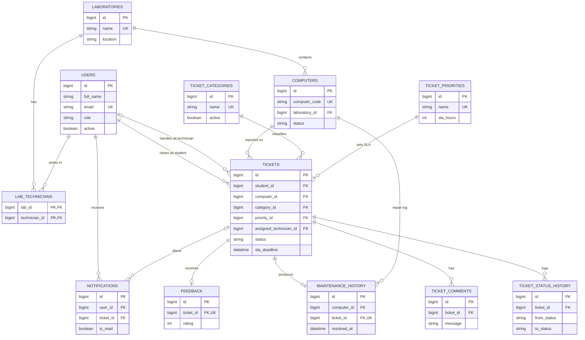

# ER Diagram - Smart Computer Laboratory IT Support System

```mermaid
erDiagram
  LABORATORIES ||--o{ COMPUTERS : contains
  LABORATORIES ||--o{ LAB_TECHNICIANS : has
  USERS ||--o{ LAB_TECHNICIANS : "works in"
  USERS ||--o{ TICKETS : "raises as student"
  USERS |o--o{ TICKETS : "handles as technician"
  COMPUTERS ||--o{ TICKETS : "reported on"
  TICKET_CATEGORIES ||--o{ TICKETS : classifies
  TICKET_PRIORITIES ||--o{ TICKETS : "sets SLA"
  TICKETS ||--o{ TICKET_STATUS_HISTORY : logs
  TICKETS ||--o{ TICKET_COMMENTS : has
  TICKETS ||--o| FEEDBACK : receives
  TICKETS ||--o| MAINTENANCE_HISTORY : produces
  COMPUTERS ||--o{ MAINTENANCE_HISTORY : "repair log"
  USERS ||--o{ NOTIFICATIONS : receives
  TICKETS |o--o{ NOTIFICATIONS : about

  USERS {
    bigint id PK
    string full_name
    string email UK
    string role
    boolean active
  }
  LABORATORIES {
    bigint id PK
    string name UK
    string location
  }
  LAB_TECHNICIANS {
    bigint lab_id PK,FK
    bigint technician_id PK,FK
  }
  COMPUTERS {
    bigint id PK
    string computer_code UK
    bigint laboratory_id FK
    string status
  }
  TICKET_CATEGORIES {
    bigint id PK
    string name UK
    boolean active
  }
  TICKET_PRIORITIES {
    bigint id PK
    string name UK
    int sla_hours
  }
  TICKETS {
    bigint id PK
    bigint student_id FK
    bigint computer_id FK
    bigint category_id FK
    bigint priority_id FK
    bigint assigned_technician_id FK
    string status
    datetime sla_deadline
  }
  TICKET_STATUS_HISTORY {
    bigint id PK
    bigint ticket_id FK
    string from_status
    string to_status
  }
  TICKET_COMMENTS {
    bigint id PK
    bigint ticket_id FK
    string message
  }
  FEEDBACK {
    bigint id PK
    bigint ticket_id FK,UK
    int rating
  }
  MAINTENANCE_HISTORY {
    bigint id PK
    bigint computer_id FK
    bigint ticket_id FK,UK
    datetime resolved_at
  }
  NOTIFICATIONS {
    bigint id PK
    bigint user_id FK
    bigint ticket_id FK
    boolean is_read
  }
```